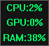

# MiniMonitor


Minimalist Windows desktop widget for real-time CPU and GPU utilization monitoring.



## 🚀 Features
- **Minimalist Design**: Small window that stays out of your way.
- **Low Overhead**: Uses Windows Performance Data Helper (PDH) API for efficient, low-resource monitoring.
- **Real-time Updates**: Refreshes every 500ms.
- **Non-Intrusive**: Uses `WS_EX_TOOLWINDOW` so it does not appear in the taskbar.
- **Lightweight**: Minimal dependencies; single executable expected for typical builds.

## 🖥️ Display Format
The widget displays current utilization in a stacked format:
```text
CPU:XX%
GPU:XX%
RAM:XX%
```

## 🖱️ Controls
| Action | Result |
| :--- | :--- |
| **Left Click & Drag** | Move the widget around your screen |
| **Double Click** | Close the widget |
| **Right Click** | Open Info/Settings window |

## 🛠️ Technical Details
- **Language**: C++
- **API**: Win32 API, PDH (Performance Data Helper)
- **Dependencies**: `pdh.lib` (linked via `#pragma comment`)
- **Build type**: Recommended Release x64 for lowest overhead
- **Window style**: borderless / toolwindow; designed for minimal screen real estate

## 🔨 Build Instructions
### Prerequisites
- **OS**: Windows 10/11
- **IDE**: Microsoft Visual Studio (with "Desktop development with C++" workload installed).

### Steps
1. Open the solution (`MiniMonitor.slnx` or `.vcxproj`) in Visual Studio.
2. Set the build configuration to **Release**.
3. Set the platform to **x64**.
4. Build the solution (**Ctrl+Shift+B**).
5. Run the generated `.exe` from the output folder (e.g., `x64/Release/`).

## 🗒️ Changelog
- x1.0.2.5 - WIP
	- Settings Window is now always on top
	- Background color can now be changed in the config file. RGB Values.
- v1.0.2.4 - 2026-09-19
	- moved creating the config file to readconfig.cpp so it doesn't clutter the main file.
	- you can now change the text color in the config file. RGB Values.
	- better icon
	- settingswindow is now created in its own cpp file. much easier to read and work on.
	- the settings window now shows the program version and the current text color.
- v1.0.2.3 - 2026-09-18
	- One pixel border for the main window. looks better now.
	- now creates a config file if it doesn't already exists. the config file does nothing so far.
- v1.0.2.2 - 2026-09-18
	- getdata functions are now in their own file. getdata.cpp The main program is more compact now.
- v1.0.2.1 - 2026-09-18
	- New Icon. Chip with graph.
 	- Added list of future plans and ideas to readme.
	- Added RAM load display. Now shows CPU, GPU, and RAM utilization.
- v1.0.2.0 — 2026-09-17
	- Changelog section in readme was gone. fixed.
	- RAM load added. Is already working, the release exe doesn't have it yet.
- v1.0.1.0 — 2026-09-17
	- Added GPU utilization display.
	- Implemented 500ms refresh cadence.
	- Control info Window added with basic instructions. Also used for settings later.
- v1.0.0.0 — 2026-09-17
	- Minimal CPU monitor UI implemented.
	- Borderless toolwindow and basic mouse controls.

## 🗒️ Planned features and improvements.
For next release
- Adding a tooltip that says "Right click for settings" when the user hovers the mouse over the main window. Note: havent figured out how yet.
- we really need the main loop to be in a separate cpp file. main.cpp is getting too cluttered.

For later
- make settings saveable instead of editing the config file manually.

## 📜 License
All rights reserved. This project is for personal use only and may not be redistributed or used commercially without permission.
